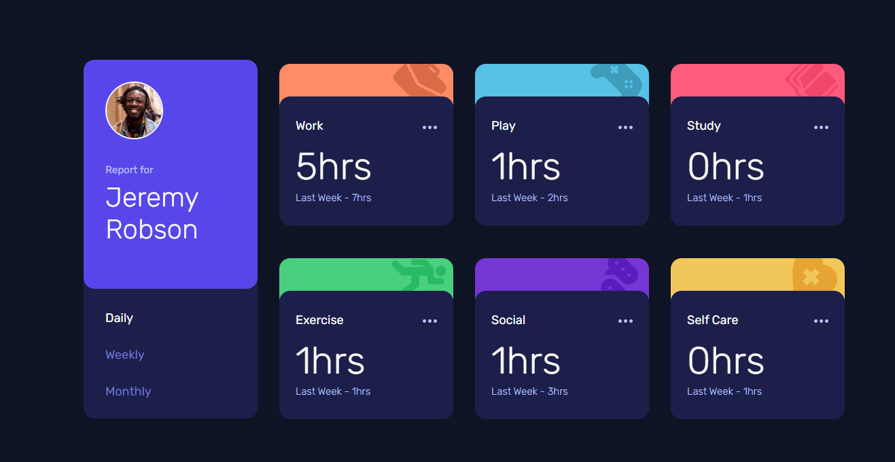
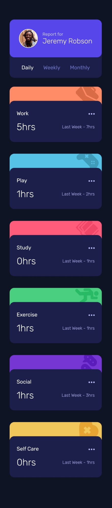

# Frontend Mentor - Time tracking dashboard solution

This is a solution to the [Time tracking dashboard challenge on Frontend Mentor](https://www.frontendmentor.io/challenges/time-tracking-dashboard-UIQ7167Jw). Frontend Mentor challenges help you improve your coding skills by building realistic projects. 

## Table of contents

- [Overview](#overview)
  - [The challenge](#the-challenge)
  - [Screenshot](#screenshot)
  - [Links](#links)
- [My process](#my-process)
  - [Built with](#built-with)
  - [What I learned](#what-i-learned)
  - [Continued development](#continued-development)
- [Author](#author)

## Overview

### The challenge

Users should be able to:

- View the optimal layout for the site depending on their device's screen size
- See hover states for all interactive elements on the page
- Switch between viewing Daily, Weekly, and Monthly stats

### Screenshot

### Links

- Solution URL: [GitHub](https://github.com/DrakeHermit/time-tracking-dashboard)
- Live Site URL: [Live Site](https://drakehermit-time-tracking.netlify.app/)

## My process

1. Wrote the HTML markup (which got updated along the way)
2. Wrote the CSS (mobile version)
3. Wrote the CSS (desktop version)
4. Started writing JS code 
  - 1. Wrote the code to highlight daily, weekly, or monthly timeframes
  - 2. Fetched the JSON data asynchronously
  - 3. Filtered the data based on which button was clicked
  - 4. Updated the DOM with the given data

### Built with

- Semantic HTML5 markup
- CSS custom properties
- Flexbox
- CSS Grid
- Mobile-first workflow
- JavaScript

### What I learned

I learned a ton working on this challenge, but my main focus with this challenge was to understand how fetching and filtering works, and then how updating the DOM works. I managed to do most of the work myself but of course I had to google how to do stuff without asking what I specifically need to do.

### Continued development

I will keep on working on my frontend dev skills as I go along completing the challenges in the learning paths. But I truly am surprised at myself as to how concepts are starting to click for me. But I am glad that I learned how to retrieve the data from JSON which is basically how an API sends and receives info.

## Author

- Frontend Mentor - [@DrakeHermit](https://www.frontendmentor.io/profile/DrakeHermit)

